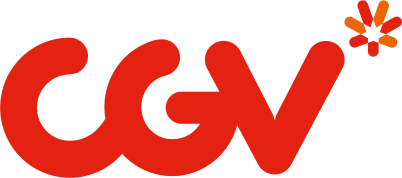

 
 

    

 

 

  

    <h3>프로젝트 소개</h3>
    <ul>
      <li>CGV 랜딩 페이지 리뉴얼 프로젝트</li>
    </ul>
    <h3>제작 정보</h3>
    <ul>
      <li>제작 기간: 2022.11.01 ~ 2022.12.22</li>
    </ul>
  

  
  

    <h3>업무 분장</h3>
    <ul>
      <li>손*진(헤더 및 우측 하단 버튼)</li>
      <li>홍*헌(무비차트)</li>
      <li>박*지(비디오 슬라이드, 이벤트, PS)</li>
      <li>윤*혁(특별관, 푸터)</li>
    </ul>
    <h3>사용 언어, 개발 환경</h3>
    <ul>
      <li>HTML, CSS, JAVASCRIPT</li>
      <li>Visual Studio Code</li>
    </ul>
  

